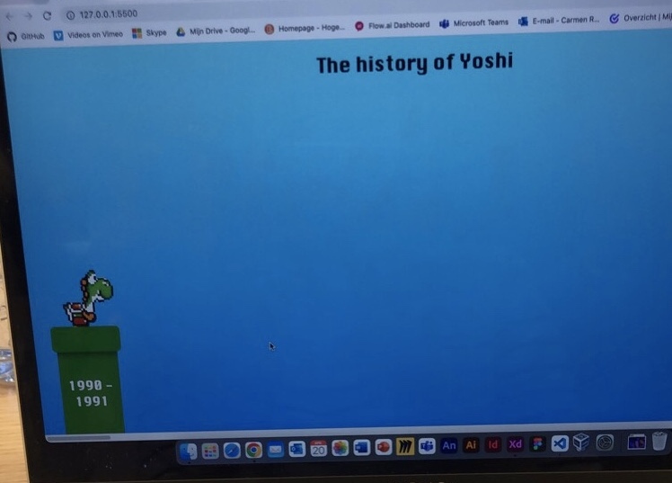

# Procesverslag
Markdown is een simpele manier om HTML te schrijven.  
Markdown cheat cheet: [Hulp bij het schrijven van Markdown](https://github.com/adam-p/markdown-here/wiki/Markdown-Cheatsheet).

Nb. De standaardstructuur en de spartaanse opmaak van de README.md zijn helemaal prima. Het gaat om de inhoud van je procesverslag. Besteedt de tijd voor pracht en praal aan je website.

Nb. Door *open* toe te voegen aan een *details* element kun je deze standaard open zetten. Fijn om dat steeds voor de relevante stuk(ken) te doen.

## Jij

### Ontwerper:
Carmen Rozendaal, 500823349

#### Je startniveau:
Ik heb al wel ervaring met code, maar dit is niet de richting waarin ik me hebt verdiept de afgelopen jaren. Dat heeft ervoor gezorgd dat de kennis erover best is weggezakt. Daarom heb ik als beginpositie gekozen voor BLAUW maar dit zou ook ROOD kunnen worden naarmate ik er meer mee bezig ben.

# Je plan

  
Ik heb de opdracht 'Tijdlijn' gekozen, hierbij ga ik me bezighouden met het karakter Yoshi. Ik heb vroeger zelf veel Mario gespeeld en ik vond Yoshi eigenlijk altijd het leukste karakter. Hij is schattig en grappig en bestaat ook al sinds het het 1e spel van Mario. Dit was in (1990). Ook zijn er veel varianten van Yoshi gemaakt.

  Het idee voor de interface is dat je als gebruiker zelf door de geschiedenis van Yoshi heen gaat. Je gaat hier doorheen door te springen / lopen op de blokken. Bij elke groene pijp die je tegenkomt, kom je in een ander tijdperk, en veranderd Yoshi hiernaar. Bij deze Yoshi komt vervolgens een card met daarin het logo van het betreffende spel en een 'info-icoon'. Wanneer je hierop klikt, flipt deze en zit hierachter meer informatie verstopt.
  

  ### De eerste versie/schets:
  
  

  ### Je ambitie: 
  Aan deze technieken/punten wil ik werken:
  - html/css/js weer onder de knie krijgen.
  - Vloeiende keyframe animaties kunnen maken.
  - Een concept kunnen omzetten naar een werkende interface.
 

## Voortgang/Feedback 1

  
Mijn bevindingen + wijzigingen (minimaal 5)

  ### Bevinding 1:
  Twijfel over keuze voor concols in interface.

  #### oplossing:
  Ik heb nagedacht over de mogelijke concols om Yoshi te laten bewegen. Ik ben hier nog niet over uit. De 'Nintendo-toetsen' passen beter bij het thema, maar zijn lastiger te realiseren aangezien ik hier veel Javascript voor moet gebruiken. Het Click & Swipe is gemakkelijker, maar daarintegen weer minder passend. Ik moet daarom kijken betreft de tijd wat het meest haalbaar is voor mij. 

  

  ### Bevinding 2:
  Feedback van Yentle op mijn ontwerp.

  #### oplossing:
  De feedback was nuttig. Ik heb gekeken naar opties om de interface wat speelser te maken. Idee: De informatie weergeven als een card. Wanneer je hierop klikt opent deze en wanneer je deze card sluit, veranderd deze naar een extra leven of ga je een level omhoog. Hier moet ik nog even de keuze voor maken. 

  

  * schets nog toevoegen aan readme.
  

  ### Bevinding 3:
  Start html/css ging moeizaam.

  #### oplossing:
  Ik ging aan de slag met het realiseren van mijn gemaakte ontwerp, maar kwam er al snel achter dat ik het erg lastig vond om html/css te schrijven. Ik heb daarom hulp gevraagt aan klasgenoten en aan de docent. Ook heb ik gebruik gemaakt van de aangereikte online tools en de opdrachten op dlo. Uiteindelijk is er een beginnetje ontstaan. 

  

## Voortgang/Feedback 2

  
Mijn bevindingen + wijzigingen (minimaal 5)

  
  ### Bevinding 1:
  Github toont afbeeldingen niet in readme.

  #### oplossing:
  Beschrijving hoe je het hebt hebt opgelost of als het niet gelukt is hoe je het zou oplossen.

  
  

  ### Bevinding 2:
  Omschrijving van wat er nog niet orde was (tekst en afbeeding(en)).

  #### oplossing:
  Beschrijving hoe je het hebt hebt opgelost of als het niet gelukt is hoe je het zou oplossen (tekst en afbeeding(en)).

  ### Bevinding 3:
  ...

## Voortgang/Feedback 3

  
Mijn bevindingen + wijzigingen (minimaal 5)

  
  ### Bevinding 1:
  Omschrijving van wat er nog niet orde was (tekst en afbeeding(en)).

  #### oplossing:
  Beschrijving hoe je het hebt hebt opgelost of als het niet gelukt is hoe je het zou oplossen (tekst en afbeeding(en)).

  ### Bevinding 2:
  Omschrijving van wat er nog niet orde was (tekst en afbeeding(en)).

  #### oplossing:
  Beschrijving hoe je het hebt hebt opgelost of als het niet gelukt is hoe je het zou oplossen (tekst en afbeeding(en)).

  ### Bevinding 3:
  ...

## Reflectie

  
Mijn eindresultaat & persoonlijke ontwikkeling

  ### Je uitkomst - karakteristiek screenshot(s):
  

  ### Dit ging goed/Heb ik geleerd: 
  Korte omschrijving met plaatje(s)

  

  ### Dit was lastig/Is niet gelukt:
  Korte omschrijving met plaatje(s)

  

## Bronnenlijst

continu bijhouden terwijl je werkt

Nb. Wees specifiek ('css-tricks' als bron is bijv. niet specifiek genoeg).

1. bron 1
2. bron 2
3. ...

